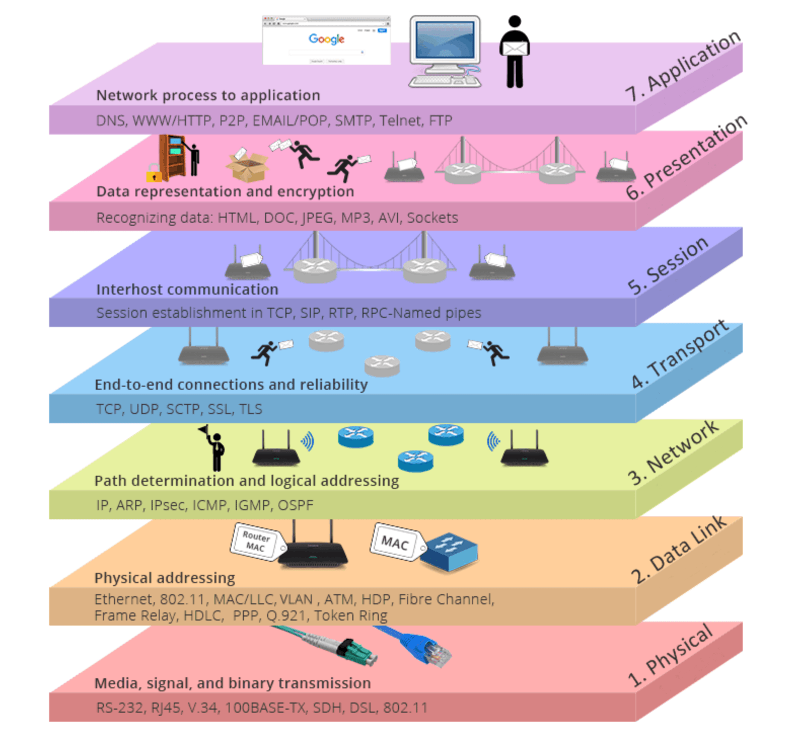

# OSI Modell



1. Physikal -> Kabel, Strom, Funk, EM, Licht, LWL
2. Data link -> Switch "NICHT Routing", ARP Adress Resolution Protokol. Ethernet Frames. => Broadcast Domain :: Topology
3. Network -> IPv4, IPv6, ARP, IPsec, ICMP, IGMP, OSPF, BGP, OSP :: Möglichkeit aus dem Netzwerk zu kommen. 

...

``` txt
8 bit = 1 byte = 1 oktett
```

https://youtu.be/zELAfmp3fXY?si=varQGsR37-md0Dn4


| bin  | dec | hex |
| ---- | --- | --- |
| 0000 | 0   | 0   |
| 0001 | 1   | 1   |
| 0010 | 2   | 2   |
| 0011 | 3   | 3   |
| 0100 | 4   | 4   |
| 0101 | 5   | 5   |
| 0110 | 6   | 6   |
| 0111 | 7   | 7   |
| 1000 | 8   | 8   |
| 1001 | 9   | 9   |
| 1010 | 10  | A   |
| 1011 | 11  | B   |
| 1100 | 12  | C   |
| 1101 | 13  | D   |
| 1110 | 14  | E   |
| 1111 | 15  | F   |

## Subnetting 

https://www.calculator.net/ip-subnet-calculator.html

192.189.51.0/24 <=> 4 gleich große Subnetze
(1100.0000 = 128+64+0+0 + 0+0+0+0 => 192)

1111 1111 . 1111 1111 . 1111 1111 . 0000 0000

==> 4 Gleich große Netze gesucht <==

255.255.255.

0 .... 63
64 .... 127
128 .... 191
192 .... 256